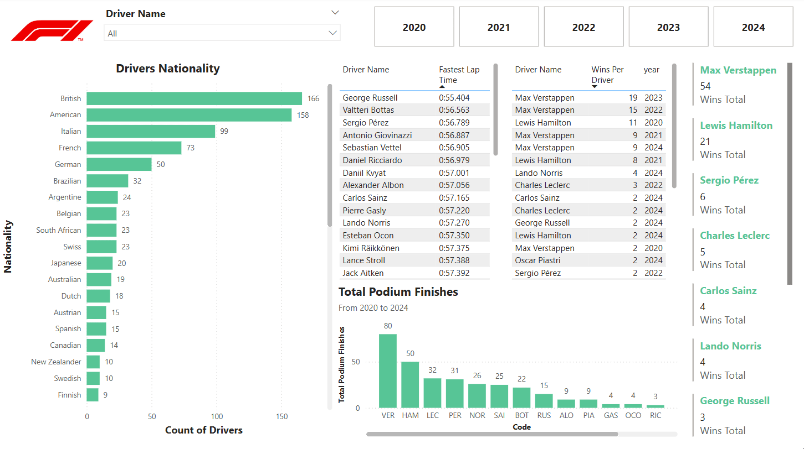

# 📊 HR Analytics Dashboard | Power BI Project

## 📝 Project Overview
Exploring the world of F1 through data! This project dives into race results, driver performance, fastest lap times, and team standings using interactive Power BI dashboards. 

---

## 📂 Dataset Description
The dataset includes the following tables and fields:
- Age, Gender, Education, Department
- Job Role, Monthly Income, Total Working Years
- Attrition Status, Job Satisfaction, Performance Rating

📁 **File:** `drivers.csv`  
📄 **Sample Rows:** 1470 employees  
📌 **Attrition Rate:** 16.1%

---

## 🛠 Tools & Technologies Used
- Power BI Desktop
- Power Query
- DAX (Data Analysis Expressions)
- CSV / Excel data sources

---

## 📎 Dashboard Features
- 🚻 **Drivers by Nationality**
- 💼 **Fastest Lap Times**
- 📉 **Wins per Driver in a Year**
- 💰 **Total Wins, Total Podium Finishes**
- 🧠 **Races Per Year, Average Finishing Positions**

---

## 📷 Dashboard Preview

---

## 🧭 Folder Structure

---

## 💡 Key Insights
- Highest attrition is in the **26-35 age group**
- **Life Sciences & Medical** backgrounds see higher attrition
- Salary band **< 5K** has the highest employee exit rate
- Specific roles like **Sales Executive** and **Lab Technicians** show higher attrition

---

## 🚀 Getting Started
1. Download `f1.pbix`
2. Open with [Power BI Desktop](https://powerbi.microsoft.com/en-us/desktop/)
3. Explore visuals and filters for insights

---

## 📬 Connect With Me
👤 **[Vladan Jančić]**  
📧 [vladan.jncc@protonmail.com]  
🔗 [LinkedIn Profile](https://www.linkedin.com/in/vladan-jančić-data/)

---
